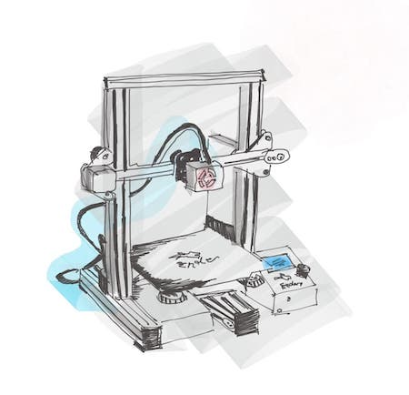

Awesome Ender 3
================

This is a list of resources for Ender 3 & Ender 3 pro 3D printers. Useful resources related to printing, mods, tutorials, etc. Hope you can find it useful!

### Software and Libraries ###
* [**Octoprint**](https://octoprint.org/) OctoPrint is the snappy web interface for your 3D printer that allows you to control and monitor all aspects of your printer and print jobs, right from your browser.

### Mods ###
* [**Filament Guide**](https://www.thingiverse.com/thing:3712330) Single print filament guide. 
* [**Display Box**](https://www.thingiverse.com/thing:4048695) Backcover for the display. 

### Tutorials ###
* [**How to Assemble Creality Ender 3?**](https://letsprint3d.net/how-to-assemble-creality-ender-3/) Step by step instructions for assembling your 3D printer.

### Misc ###
* [**Ender 3 sub-reddit**](https://www.reddit.com/r/ender3/) A good place to find information about anything related to the Ender 3 from setup, to help with your prints, to showing off some of your creations. You can ask questions, look for advice, post about issues, and search for suggestions.
